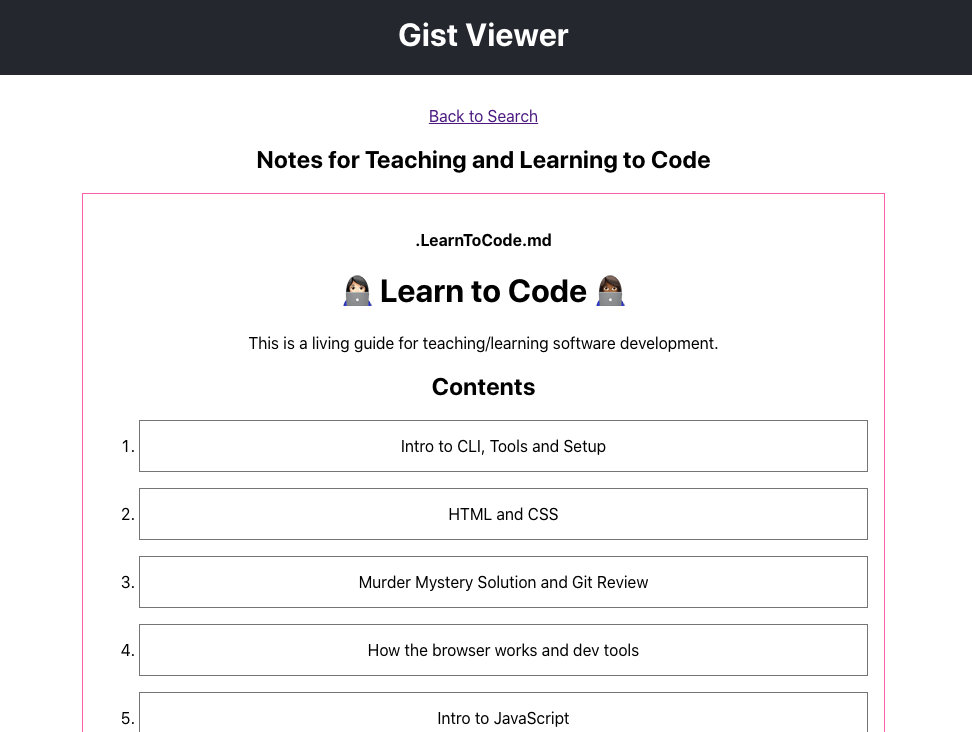

# Gist Viewer

## What does this do?

- Fetches all public gists by user
- Displays files on gist detail page

## Running Locally

- `git clone git@github.com:elanalynn/gist-viewer.git`
- `yarn install`
- `yarn start`
